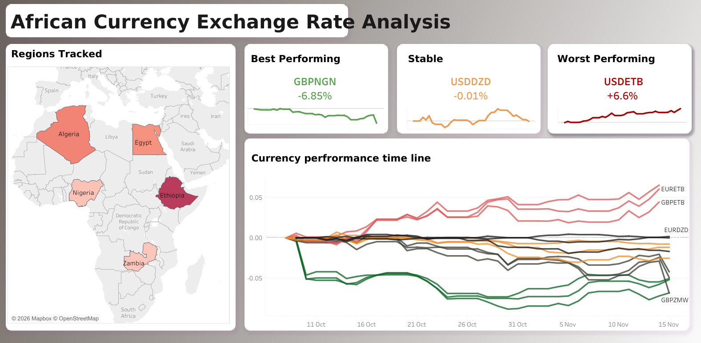
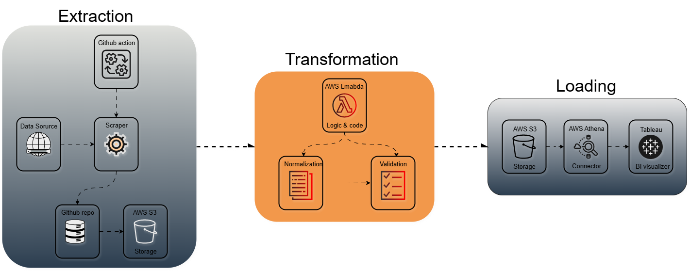

# African Central Bank Exchange Rates Dataset

## 📖 Overview
A curated collection of daily exchange rates from African central banks, automatically updated via web scraping pipelines. This project captures currency fluctuations from Ethiopia, Nigeria, Egypt, Zambia, and Algeria's official sources to create a unique pan-African forex dataset.

The down stream analysis uses the produced data to extract meaning full information accordingly

## 🏗️ Data Architecture

The data architcture follows the Medallion Architecture **Bronze** and **Silver** are specifically used

### 🌍 Data Sources
- **Ethiopia**: National Bank of Ethiopia
- **Nigeria**: Central Bank of Nigeria  
- **Egypt**: Central Bank of Egypt
- **Zambia**: Bank of Zambia
- **Algeria**: Bank of Algeria

### 🔄 Data Pipeline Architecture
- **Scrapers**: Python scripts handling each bank's unique website structure
- **Automation**: GitHub Actions run daily to capture latest rates
- **Storage**: AWS S3 for raw and processed data
- **Analysis**: Interactive dashboards and trend analysis

## 📊 What's in the Dataset?
- Daily exchange rates against major currencies (USD, EUR, GBP, etc.)
- Timestamped records for trend analysis
- Clean, structured format ready for analysis
- Historical data dating from project inception

## 🚀 Getting the Data
The processed dataset is available in multiple formats:
- **For Analysis**: Parquet files in S3 (via Athena queries)
- **For Dashboards**: Pre-processed JSON for web applications
- **Raw Access**: Original scraped data for transparency

## 📈 Sample Use Cases
- Currency correlation analysis across African markets
- Forex trend identification and visualization
- Economic research on African financial markets
- Educational resources for African economics

## 🔧 Technical Stack
- **Scraping**: Python, BeautifulSoup, Requests
- **Automation**: GitHub Actions, AWS Lambda
- **Storage**: AWS S3, Athena
- **Analytics**: Python (Pandas, Plotly), QuickSight
- **Visualization**: React, Plotly.js

## 📝 Project Status
✅ **Live**: All scrapers running daily via GitHub Actions  
✅ **Data**: Historical data available from project start date  
✅ **Dashboards**: Sample analytics deployed  
🔄 **Expanding**: Adding more African countries gradually

## 🤝 Contributing
Interested in adding another African country's central bank data? Open an issue with the website details and let's collaborate!

---

*Data for African financial insight - because local data matters.*
